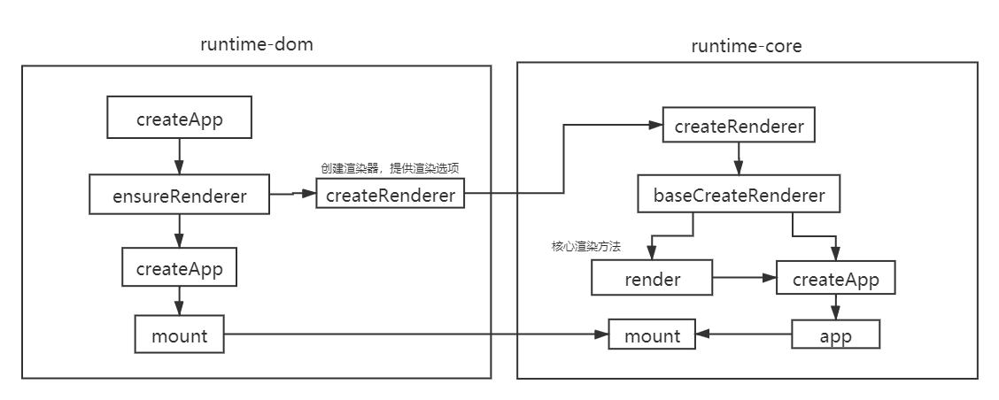

# Vue3 渲染原理



## Vue3中组件和节点渲染

```html
<div id="app"></div>
<script src="/node_modules/vue/dist/vue.global.js"></script>
<script>
    const { createApp, h, reactive } = Vue;
    const App = {
        setup() {
            const state = reactive({ name: 'chenwl' })
            return () => { // 返回的就是render函数
                return h('div', {style:{color:'red'}}, `我是 ${state.name}`)
            }
        }
    }
    createApp(App).mount('#app');
</script>
```

## 实现createApp

`runtime-dom` 文件目录
```
- runtime-dom
    - index.ts
    - nodeOpts.ts
    - patchProp.ts
```

> `runtime-dom`的作用是提供DOM和元素属性的操作

`nodeOpts` 如下：
```ts
export const nodeOpts = {
    createElement(type){
        return document.createElement(type)
    },
    insert(child, parent, anchor=null){
        parent.insertBefore(child,anchor)
    },
    remove(child){
        const parent = child.parentNode;
        if(parent){
            parent.removeChild(child)
        }
    },
    setElementText(el,content){
        el.textContent = content;
    },
    createTextNode(content){
        return document.createTextNode(content);
    }
}
```

`patchProp` 如下：
```ts
function patchStyle(el, prev, next) {
  const style = el.style
  if (!next) {
    el.removeAttribute('style')
  } else {
    for (let key in next) {
      style[key] = next[key]
    }
    if (prev) {
      for (let key in prev) {
        if (!next[key]) {
          style[key] = ''
        }
      }
    }
  }
}

function patchClass(el, next) {
  if (next == null) {
    next = ''
  }
  el.className = next
}

function patchAttr(el, key, value) {
  if (value == null) {
    el.removeAttribute(key)
  } else {
    el.setAttribute(key,value)
  }
}

export function patchProp(el, key, prevValue, nextValue) {
  switch (key) {
    case 'style':
      patchStyle(el, prevValue, nextValue)
      break
    case 'className':
      patchClass(el, nextValue)
      break
    default:
      patchAttr(el, key, nextValue)
  }
}
```

`runtime-dome/index.ts` 核心：
```ts
import { createRenderer } from '../runtime-core/index'
import { nodeOpts } from './nodeOpts'
import { patchProp } from './patchProp'

function ensureRenderer() {
  // 传入一些dom的api操作，创建、删除、添加、属性更新
  return createRenderer({ ...nodeOpts, patchProp })
}

export function createApp(rootComponent) {
  // 核心调用内层 runtime-core 中的createApp
  const app = ensureRenderer().createApp(rootComponent)
  const { mount } = app

  app.mount = function (container) {
    // 先清空内容
    container = document.querySelector(container);
    container.innerHTML = "";
    // 调用底层 mount 方法
    mount(container)
  }

  return app
}
``` 

## 实现mount

`runtime-core`的作用是运行时核心和平台本身无关

`runtime-core` 文件目录如下：

```
-runtime-core
    - index.ts
    - apiCreateApp.ts
    - component.ts
    - h.ts
    - renderer.ts
    - vnode.ts
```

`index.ts` 导出方法如下：
```ts
export { createRenderer } from "./renderer";
export { h } from "./h"
```

`createRenderer`负责提供渲染函数`render`, 并导出 `createAppApi` 方法：

```ts
// options 参数包含平台操作方法（nodeOpts,patchProp）
function createRenderer(options){
    
    const render = (vnode, container)=>{
        ...
    }
    
    return {
        createApp: createAppApi(render),
    }
}
```

`createAppApi` 如下：
```ts
import { createVNode } from './vnode'

export function createAppApi(render) {
  return (component) => {
    let app = {
      mount(container) {
        const vnode = createVNode(component) // 根据组件创建虚拟节点
        render(vnode,container) // 通过虚拟节点进行渲染
      },
    }
    return app
  }
}
```

## createVnode方法

定义虚拟节点的类型 `shared/shapeFlags.ts`:
```ts
export const enum ShapeFlags {
    ELEMENT = 1, // 普通元素
    FUNCTION_COMPONENT = 1 << 1, // 函数组件
    STATEFUL_COMPONENT = 1 << 2, // 带状态组件
    TEXT_CHILDREN = 1 << 3, // 文本孩子
    ARRAY_CHILDREN = 1 << 4 // 数组孩子
}

// ELEMENT 0000000001
// FUNCTIONAL_COMPONENT 0000000010
// STATEFUL_COMPONENT 0000000100
// TEXT_CHILDREN 0000001000
// ARRAY_CHILDREN 0000010000
```

> shapeFlags 目的是通过二进制按位运算，方便判断当前vnode类型

按位运算：
- a & b：对于每一个比特位，只有两个操作数相应的比特位都是1时，结果为1，否则为0。
- a | b：对于每一个比特位，当两个操作数相应的比特位至少有一个1时，结果为1，否则为0。

`vnode.ts`如下：
```ts
import { isArray, isObject, isString, ShapeFlags } from '../shared/index'

export function createVNode(type, props = {} as any, children = null) {

  // 判断 shapeFlag 是组件还是元素
  const shapeFlag = isString(type)
    ? ShapeFlags.ELEMENT
    : isObject(type)
    ? ShapeFlags.STATEFUL_COMPONENT
    : 0

  let vnode = {
    type,
    props,
    children,
    component: null, // 组件实例，用于保存组件对应实例
    el: null,
    key: props.key,
    shapeFlag, // 描述虚拟节点的类型
  }

  if (isArray(children)) {
    vnode.shapeFlag |= ShapeFlags.ARRAY_CHILDREN // 16 
  } else {
    // 组件里面可能是空也可能是文本
    vnode.shapeFlag |= ShapeFlags.TEXT_CHILDREN // 8
  }
  
  return vnode;
}
```

> 这里使用了|= 相当于对类型取了合集

`h.ts` 导出虚拟dom创建方法：
```ts
import { createVNode } from './vnode'

export function h(type, props, children) {
  return createVNode(type, props, children)
}
```

## render方法

使用 `patch` 拆分 组件和元素的初始化工作：

```ts
   const processElement = (n1, n2, container) => {
        // 元素初始化
    }
    const processComponent = (n1, n2, container) => {
        // 组件初始化
    }
  /*
   * @params n1 上一次渲染vnode
   * @params n2 本次渲染vnode
   * @params container 容器dom
   */
  const patch = (n1, n2, container) => {
    // 开始渲染
    let { shapeFlag } = n2
    if (shapeFlag & ShapeFlags.ELEMENT) {
      processElement(n1, n2, container)
    } else if (shapeFlag & ShapeFlags.STATEFUL_COMPONENT) { // 全是1 才是1
      processComponent(n1, n2, container)
    }
  }

  const render = (vnode, container) => {
    // 判断 初次渲染 || 更新渲染
    patch(null, vnode, container)
  }
```

### 默认先渲染组件

```ts
const processComponent = (n1, n2, container) => {
    // 组件初始化
    if(n1 == null){
        mountComponent(n2,container);
    }else{
        // 组件更新逻辑
    }
}
```

### 组件渲染过程

`component.ts` 文件负责处理跟组件相关的方法。

创建组件实例：
```ts
export function createComponentInstance(vnode) {
  const instance = {
    type: vnode.type,
    props: {},
    vnode,
    subTree: null, // 组件对应的子元素虚拟节点 _node $vnode
    render: null, // 渲染函数
    setupState: null, // setup 返回的状态
    isMounted: false, // 组件是否挂载
  }
  return instance;
}
```

初始化组件:
```ts
const setupComponent = (instance) => {
    setupStatefulComponent(instance);
}
const setupStatefulComponent = (instance) => {
    const Component = instance.type;
    const { setup } = Component;
    if (setup) {
        const setUpResult = setup(); // 获取setup返回值
        handleSetupResult(instance, setUpResult); // 处理返回值
    }
}
const handleSetupResult = (instance, setUpResult) => {
    if (isFunction(setUpResult)) {
        instance.render = setUpResult; // 如果是函数就是render函数
    } else if (isObject(setUpResult)) {
        instance.setupState = setUpResult; // 就是setup返回的状态
    }
    finishComponentSetup(instance); // 调用render
}
const finishComponentSetup = (instance) => {
    const Component = instance.type;
    if (Component.render) {
        instance.render = Component.render;
    } else if (!instance.render) {
        // 模板编译
    }
}
```


回到 `render.ts`:
```ts
const mountComponent = (vnode, container) => {
    // 根据虚拟dom创建实例
    const instance = (vnode.component = createComponentInstance(vnode))

    // 找到组件setup方法
    setupComponent(instance)

    // 设置渲染effect
    setupRenderEffect(instance, container)
}
```

创建渲染effect：
```ts
  function setupRenderEffect(instance, container) {
    effect(() => {
      if (!instance.isMounted) {
          // 调用render方法拿到组件中返回的内容
        let subTree = (instance.subTree = instance.render())
        patch(null, subTree, container)
        instance.isMounted = true
      } else {
          // 组件更新
        console.log('update')
      }
    })
  }
```

### 元素渲染过程


```ts
const processElement = (n1, n2, container) => {
    // 元素初始化
    if (n1 == null) {
        mountElement(n2,container);
    }
}

// 创建真实DOM
const mountElement = (vnode, container) => {
    // 获取操作DOM方法
    const {
      createElement: hostCreateElement,
      insert: hostInsert,
      remove: hostRemove,
      setElementText: hostSetElementText,
      createTextNode: hostCreateNode,
      patchProp: hostPatchProp,
    } = options

    let { shapeFlag, props, children, type } = vnode

    // 将真实节点和虚拟节点关联起来
    let el = (vnode.el = hostCreateElement(type))

    // 渲染子元素
    if (shapeFlag & ShapeFlags.TEXT_CHILDREN) {
      hostSetElementText(el, children)
    } else {
      mountChildren(children, el)
    }

    if (props) {
      for (let key in props) {
        hostPatchProp(el, key, null, props[key])
      }
    }
    // 插入操作
    hostInsert(el, container)
  }
    
    // 挂载子元素
  const mountChildren = (children, container) => {
    for (let i = 0; i < children.length; i++) {
      patch(null, children[i], container)
    }
  }
```


